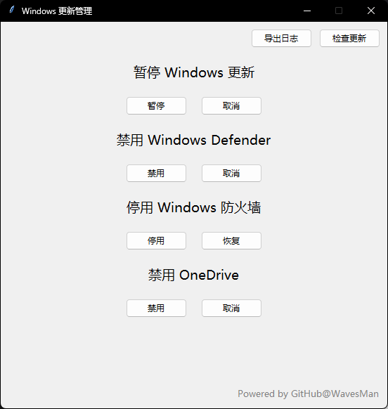

# 目录
- [你有一些新的想法或建议？](https://github.com/WavesMan/Disable-automatic-Windows-update?tab=readme-ov-file#new-ideals)
- [基于Python GUI的exe应用程序](https://github.com/WavesMan/Disable-automatic-Windows-update?tab=readme-ov-file#基于Python-GUI的exe应用程序)
- [禁用Windows自动更新](https://github.com/WavesMan/Disable-automatic-Windows-update?tab=readme-ov-file#disable-Windows-updatebat)
- [禁用Windows Defender](https://github.com/WavesMan/Disable-automatic-Windows-update?tab=readme-ov-file#disable-Windows-Defenderbat)
- [禁用One Dirve](https://github.com/WavesMan/Disable-automatic-Windows-update?tab=readme-ov-file#disable-Windows-OneDirvebat)
- [Sponsor | 赞助](https://github.com/WavesMan/Disable-automatic-Windows-update?tab=readme-ov-file#Sponsor)

---
## 基于Python GUI的exe应用程序
### 预览：

<br>[点此前往下载](https://github.com/WavesMan/Disable-automatic-Windows-update/releases/tag/EXE-v1.7)

### 本地构建（uv）
在 `python` 目录执行：
```powershell
pwsh -ExecutionPolicy Bypass -File .\build.ps1 -UpxDir "C:\Users\diwei\PyCharmMiscProject\upx"
```
构建行为说明：
<br>- 读取 `python/pyproject.toml` 的 `version-id` 和 `exe-name-template`
<br>- 固定使用 `python/windows.ico` 作为可执行文件图标
<br>- `UPX` 目录由 `-UpxDir` 手动传入，便于开源项目在不同机器复用
<br>- 未传 `-UpxDir` 时仍可构建，但不会启用 UPX 压缩
<br>- 产物命名为 `Windows_Update_Manager_<VersionID>.exe`（例如 `Windows_Update_Manager_EXE-v2.2.exe`）

---
## disable-Windows-update.bat

使Windows10以上系统暂停自动更新，防止系统自动升级
<br>当前版本bat运行后将会使Windows自动更新暂停至2050-01-01 00:00:00
<br>用法：
<br>下载最新稳定版本 "[disable-Windows-update.bat](https://github.com/WavesMan/Disable-automatic-Windows-update/releases/tag/v1.0)"
<br>下载最新测试版本 "[disable-Windows-update.bat](https://github.com/WavesMan/Disable-automatic-Windows-update/releases/tag/v1.1)"
```
运行 "disable-Windows-update.bat"
选择 "1. 暂停Windows自动更新" 将会使Windows自动更新暂停至2050-01-01 00:00:00
选择 "2. 取消暂停Windows自动更新" Windows自动更新将恢复正常
```
> 如果您需要修改此脚本，请注意此脚本使用的字符集为ANSI，请使用记事本等文本编辑器打开并修改

### 一些常见问题
<p>Q：此脚本的禁用Windows自动更新会不会影响Microsoft Store运行
<br>A：2025-01-09测试结论：不会，如果您无法打开请检查网络环境
<p>Q：想要恢复Windows自动更新怎么办
<br>A：再次运行此脚本，选择 "2. 取消暂停Windows自动更新"


---
## disable-Windows-Defender.bat

此脚本将会禁用Windows Defender，这可能会影响计算机系统安全
<br>脚本运行后需要**重新启动计算机**设置才会生效
<br>**因禁用Windows Defender导致的计算机系统安全问题，脚本制作者不承担任何责任**
<br>用法：
下载 "[disable-Windows-Defender.bat](https://github.com/WavesMan/Disable-automatic-Windows-update/releases/v1.1)"
```
运行 "disable-Windows-Defender.bat"
选择 "1. 关闭Windows Defender" 将会禁用 Windows Defender
选择 "2. 取消关闭Windows Defender" Windows Defender 将会继续启用
```
> 如果您需要修改此脚本，请注意此脚本使用的字符集为ANSI，请使用记事本等文本编辑器打开并修改


---
## disable-Windows-OneDirve.bat

此脚本将会禁用Windows OneDrive，这可能会影响你的正常工作文件备份
<br>脚本运行后需要**重新启动计算机**设置才会生效
<br>**因禁用Windows OneDrive导致的正常工作文件备份，脚本制作者不承担任何责任**
<br>用法：
下载 "[disable-Windows-OneDirve.bat](https://github.com/WavesMan/Disable-automatic-Windows-update/releases/v1.1)"
```
运行 "disable-Windows-Defender.bat"
选择 "1. 关闭Windows OneDrive" 将会禁用 Windows OneDrive
选择 "2. 取消关闭Windows OneDrive" Windows OneDrive 将会继续启用
```
> 如果您需要修改此脚本，请注意此脚本使用的字符集为ANSI，请使用记事本等文本编辑器打开并修改

## 更新历史

#### v2.0 2025-12-24
  - 完整重构 Python GUI，解藕设计
  - 新增 禁/启用 Windows 防火墙
  - 修复 OneDrive 禁用无效的问题
  - 重新设计了 UI，更加简化
  - 复用部分组件，将打包大小从 9.34MB 降低到 8.92MB

---
# New-Ideals
你有一些建议或想法想要提出？
前往[创意-ideas](https://github.com/WavesMan/Disable-automatic-Windows-update/discussions/categories/%E5%88%9B%E6%84%8F-ideas)提出


---
# Sponsor

Support this project by becoming a sponsor. Your support helps keep this project alive!

| Platform       | Link                                                                 |
|----------------|---------------------------------------------------------------------|
| 💖 爱发电       | [Sponsor on Aifadian](https://afdian.net/a/wavesman)           |
| 💰 支付宝       | [Sponsor on AliPay](https://github.com/WavesMan/Disable-automatic-Windows-update/blob/main/src/AliPay.jpg)    |
| 🎁 微信         | [Sponsor on WeChat](https://github.com/WavesMan/Disable-automatic-Windows-update/blob/main/src/WeChat.png)    |
| ⭐ Patreon     | [Sponsor on Patreon](https://patreon.com/Waves_Man)      |
| 🌟 PayPal      | [Donate via PayPal](https://paypal.me/wavesman)                |
